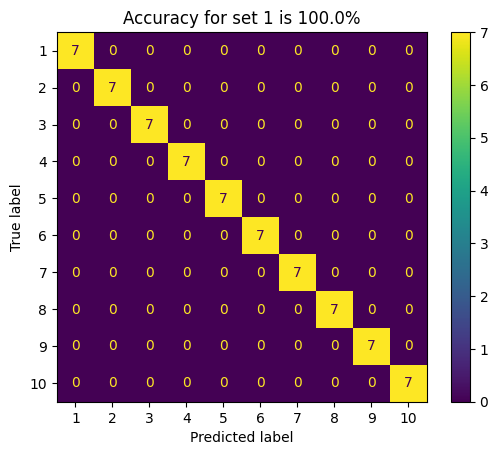
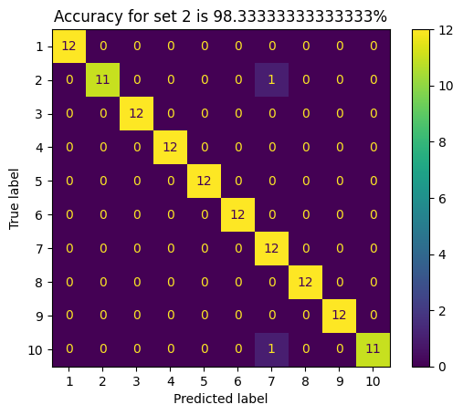
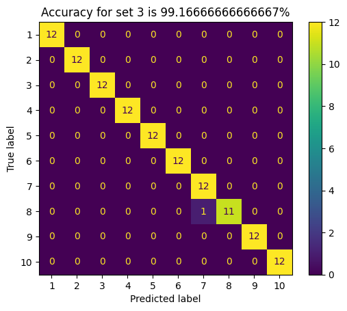
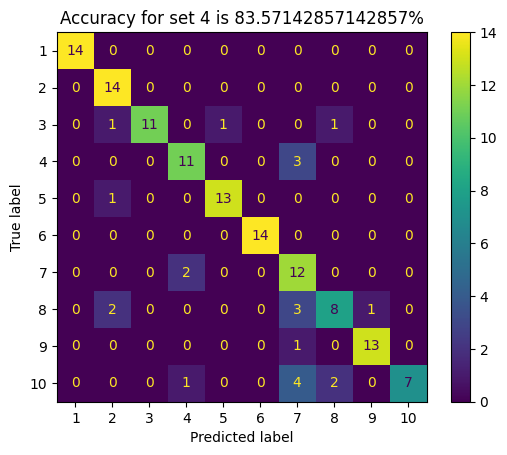
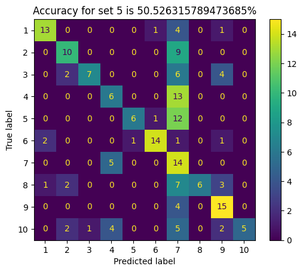

# Eigenfaces for Face Recognition

## Introduction
This project implements the Eigenfaces method for face recognition using PCA (Principal Component Analysis). Eigenfaces combine PCA for feature extraction and the nearest neighbor classifier for face recognition. The dataset used in this project is the Yale B dataset, containing images of 10 individuals under 64 different lighting conditions.

## Usage

### 1. Training and Testing
The Eigenfaces method was trained with two different values of dimensionality (`d`): 9 and 30. Here are the results for accuracy on different sets:

**Dimension: 9**

- Accuracy of Set 1: 100.0%
- Accuracy of Set 2: 96.67%
- Accuracy of Set 3: 83.33%
- Accuracy of Set 4: 41.43%
- Accuracy of Set 5: 24.21%

**Dimension: 30**

- Accuracy of Set 1: 100.0%
- Accuracy of Set 2: 98.33%
- Accuracy of Set 3: 99.17%
- Accuracy of Set 4: 83.57%
- Accuracy of Set 5: 50.53%
  
    

As expected, the accuracy is 100% for Set 1 due to training with this set. Increasing the dimensionality (d = 30) improves accuracy for other sets as it captures more facial features.

### 2. Eigenfaces Visualization
The top 9 eigenfaces obtained after training the Eigenfaces method on Set 1 were visualized. Each eigenvector captures unique patterns or characteristics in the face images. Eigenfaces are arranged in descending order of their significance.

### 3. Image Reconstruction
Using the eigenfaces obtained from Set 1, random images from each of the 5 sets for both dimensions (9 and 30) were reconstructed. The original and reconstructed images were compared to assess the quality of reconstruction.

### 4. Singular Vectors vs. Eigenfaces
The top 9 singular vectors obtained by applying Singular Value Decomposition (SVD) to the data matrix of Set 1 were displayed. Comparing these singular vectors with the eigenfaces, differences and similarities were noted, discussing their relevance to face recognition.

## Results and Discussion

### Classification Accuracy
The Eigenfaces method achieved high accuracy for Set 1 and improved accuracy for other sets with increased dimensionality (d = 30). This demonstrates the method's effectiveness in handling varying lighting conditions.

### Eigenfaces Interpretation
Eigenfaces capture facial features and variations in the dataset. They play a crucial role in recognizing faces under different lighting conditions.

### Image Reconstruction Quality
The quality of image reconstruction improved with higher dimensionality, allowing better preservation of facial details.

### Singular Vectors vs. Eigenfaces
Singular vectors and eigenfaces have differences, primarily due to normalization during PCA. These differences impact their role in face recognition.

## Conclusion
In conclusion, the Eigenfaces method is effective for face recognition, with higher dimensionality providing better results. However, it may struggle with extreme lighting variations. Understanding eigenfaces and their relationship with singular vectors enhances our grasp of this technique.

---

In this README, the key aspects of the Eigenfaces method are summarized, results are presented, and their implications in face recognition are discussed.
