# Eigenfaces for Face Recognition

## Introduction
This project implements the Eigenfaces method for face recognition using PCA (Principal Component Analysis). Eigenfaces combine PCA for feature extraction and the nearest neighbor classifier for face recognition. The dataset used in this project is the Yale B dataset, containing images of 10 individuals under 64 different lighting conditions.

The code along with a detailed analysis can be found in the  notebook.

## Training and Testing
From the Yale B face dataset, the following subsets are used:

- Set_1: person_01.png to person_07.png (i.e., the first 7 images of each individual)
- Set_2: person_08.png to person_19.png
- Set_3: person_20.png to person_31.png
- Set_4: person_32.png to person_45.png
- Set_5: person_46.png to person_64.png

The Eigenfaces method was trained with two different values of dimensionality 9 and 30.
Here are the results for accuracy on different sets:

**Dimension: 9**

- Accuracy of Set 1: 100.0%
- Accuracy of Set 2: 96.67%
- Accuracy of Set 3: 83.33%
- Accuracy of Set 4: 41.43%
- Accuracy of Set 5: 24.21%

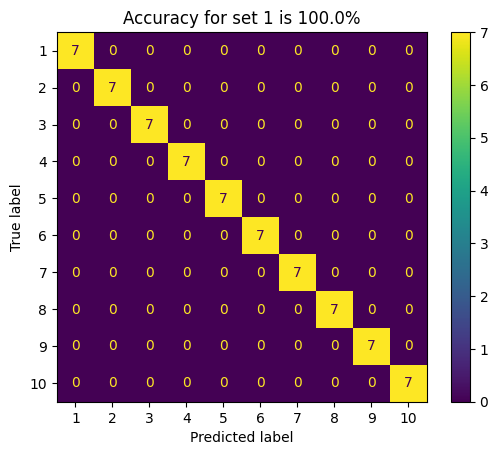 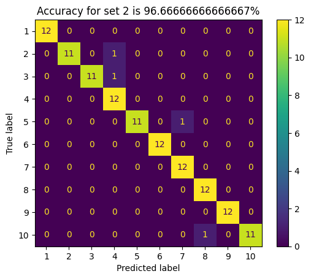 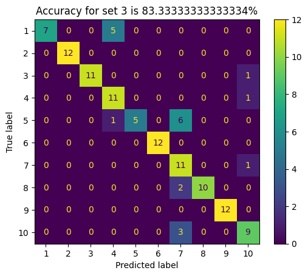 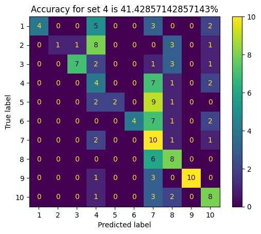 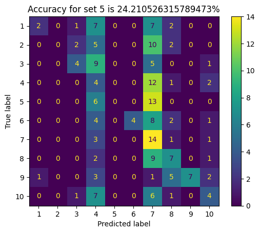

**Dimension: 30**

- Accuracy of Set 1: 100.0%
- Accuracy of Set 2: 98.33%
- Accuracy of Set 3: 99.17%
- Accuracy of Set 4: 83.57%
- Accuracy of Set 5: 50.53%
  
 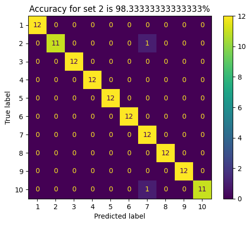 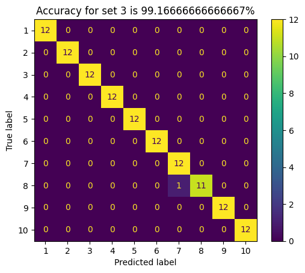 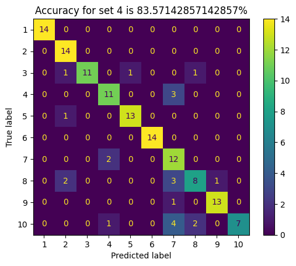 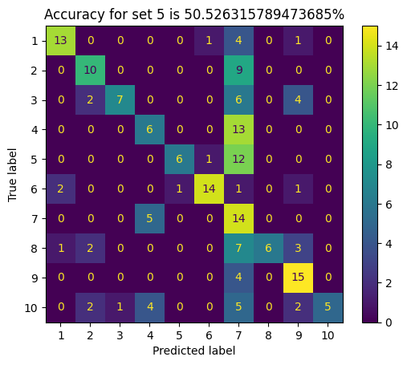

As expected, eigenfaces method achieved high accuracy for Set 1 and improved accuracy for other sets with increased dimensionality (d = 30), as it captures more facial features. This demonstrates the method's effectiveness in handling varying lighting conditions.

## Eigenfaces Visualization
The top 9 eigenfaces obtained after training the Eigenfaces method on Set 1 were visualized. Each eigenvector captures unique patterns or characteristics in the face images. Eigenfaces are arranged in descending order of their significance.

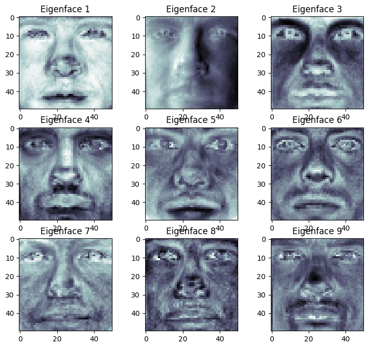

## Image Reconstruction
Using the eigenfaces obtained from Set 1, random images from each of the 5 sets for both dimensions (9 and 30) were reconstructed. The original and reconstructed images were compared to assess the quality of reconstruction. 

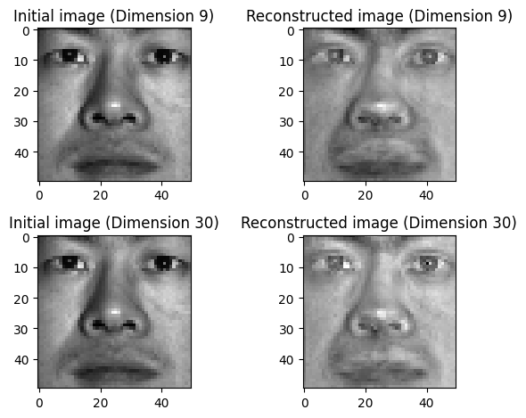 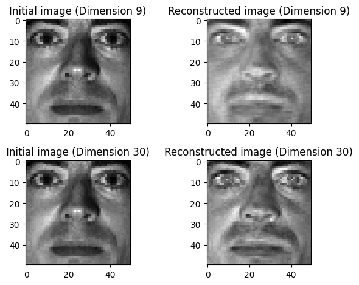 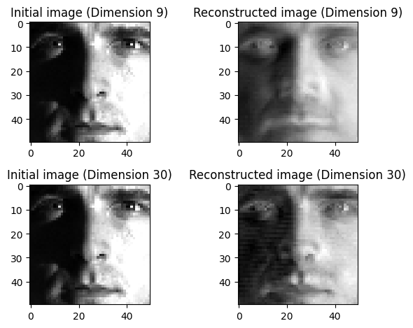 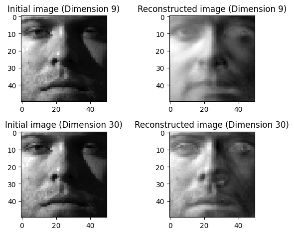 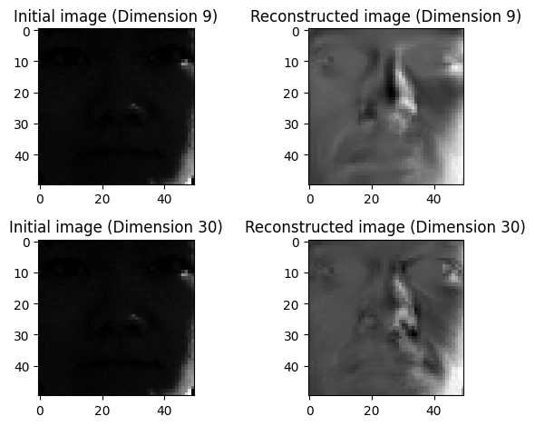

The quality of image reconstruction improved with higher dimensionality, allowing better preservation of facial details.

## Eigenfaces vs Singular Vectors
The top 9 singular vectors obtained by applying Singular Value Decomposition (SVD) to the data matrix of Set 1 were displayed.

**Eigenfaces**
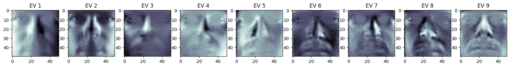

**Singular Vectors**
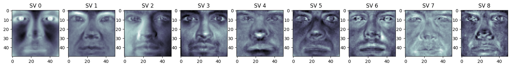
